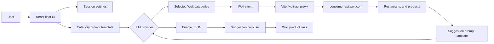
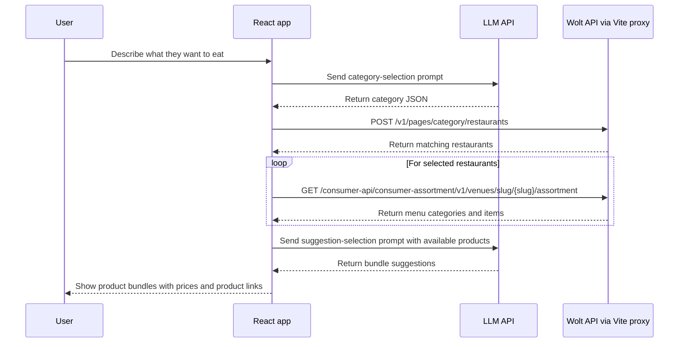
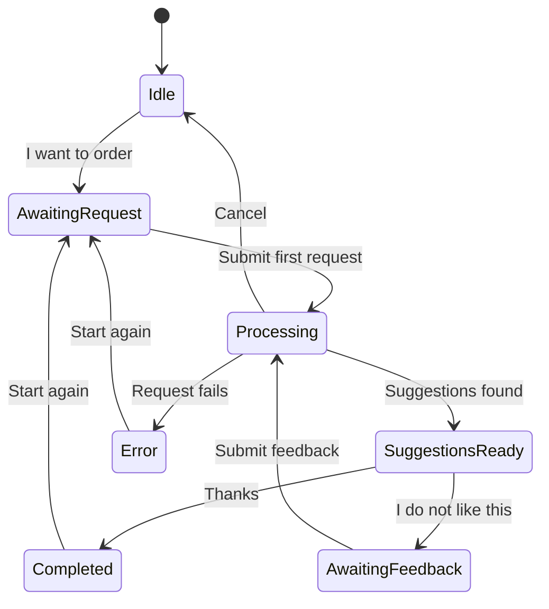
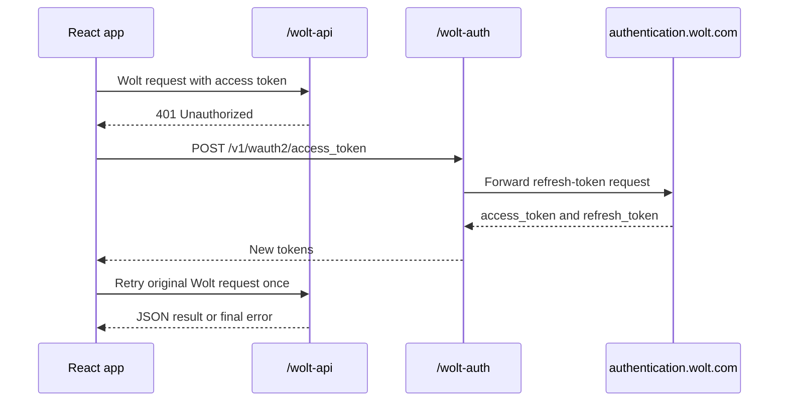

# Foodie Assistant

Foodie Assistant is a local React and TypeScript web app for building Wolt food suggestions from a chat-like ordering flow. A user describes what they want to eat, the app asks an LLM to choose relevant Wolt categories, scrapes restaurants and products from Wolt, then asks the LLM to compose product bundles that fit the request.

Each final suggestion is an order bundle. A bundle can contain one product, several products, and product quantities. When the single-restaurant option is enabled, all products in a bundle must come from the same Wolt restaurant. Product images, titles, and bundle rows link directly to the corresponding Wolt product page.

## Features

- Chat-style order flow with first request and follow-up feedback.
- OpenAI-compatible and Gemini `generateContent` LLM request formats.
- XML-like prompt templates stored as project files.
- Wolt category, restaurant, and product scraping through Vite proxies.
- Optional Wolt access token and refresh token support, with one silent retry after a `401`.
- Configurable people count, budget, notes, category count, suggestion count, restaurant/product limits, and scrape delay.
- Session-based settings persistence through browser `sessionStorage`.

## Quick Start

```bash
npm install
npm run dev
```

Open the Vite URL shown in the terminal, usually `http://127.0.0.1:5173/`.

For production checks:

```bash
npm run build
npm run lint
```

## Configuration

The settings panel controls runtime behavior. Settings are stored in browser `sessionStorage`, so they persist for the browser session but are not committed to the repository.

Selected defaults can also be loaded from a local `.env` file. Copy `.env.example` to `.env` or `.env.local` and fill in local values before starting Vite. Because this is a client-side Vite app, only `VITE_*` variables are available to the browser bundle.

```text
VITE_LLM_API_KEY=
VITE_WOLT_AUTH_TOKEN=
VITE_WOLT_REFRESH_TOKEN=
VITE_WOLT_AUTH_HEADER_NAME=Authorization
VITE_WOLT_LATITUDE=47.157435
VITE_WOLT_LONGITUDE=27.5815901
VITE_WOLT_CITY=iasi
```

Environment values are used as defaults. Values already saved in browser `sessionStorage` take precedence until settings are reset or the browser session storage is cleared.

| Area | Important settings |
| --- | --- |
| LLM | Provider, API URL, model, API key, auth header |
| Wolt | Access token, refresh token, auth header, city, country, latitude, longitude |
| Order | Category count, suggestion count, people count, budget, special mentions, single-restaurant bundle option |
| Scraping | Delay between Wolt calls, restaurants per category, popular item limit, popular-only product filtering |

Default location settings target Iasi, Romania:

```text
city=iasi
country=rou
latitude=47.157435
longitude=27.5815901
currency=RON
language=en
```

## System Overview



## Order Flow



## Session State



## Wolt Integration

Local development uses Vite proxies because Wolt browser calls expect Wolt origins and web-like headers.

| Local path | Upstream target | Purpose |
| --- | --- | --- |
| `/wolt-api` | `https://consumer-api.wolt.com` | Category, restaurant, and menu data |
| `/wolt-auth` | `https://authentication.wolt.com` | Refresh-token exchange |

Important Wolt calls:

- `POST /v1/pages/category/restaurants` fetches restaurants for a category filter at the configured latitude and longitude.
- `GET /consumer-api/consumer-assortment/v1/venues/slug/{venueSlug}/assortment?language=en` fetches menu categories and products for a restaurant.
- When `Only retrieve popular items` is enabled, only products with a `popular` tag are kept, up to the configured product limit per restaurant.
- When `Only retrieve popular items` is disabled, every listed product returned by the restaurant assortment endpoint is kept.

## Wolt Auth Refresh

If a Wolt scraping request returns `401` and a refresh token is configured, the app refreshes credentials once and retries the original request once.



Refresh body format:

```text
grant_type=refresh_token&refresh_token=<refresh-token>
```

## LLM Providers

The provider abstraction lives in `src/services/llm.ts`.

| Provider | Request shape | Default URL | Default model |
| --- | --- | --- | --- |
| OpenAI compatible | `messages: [{ role, content }]` | `https://api.openai.com/v1/chat/completions` | `gpt-4o-mini` |
| Gemini | `contents[].parts[].text` | `https://generativelanguage.googleapis.com/v1beta/models/{model}:generateContent` | `gemini-3.1-flash-lite` |

Gemini uses `generationConfig.responseMimeType = "application/json"`. If a Gemini stream URL is entered manually, the response parser accepts server-sent `data:` chunks and joins the returned text.

## Prompt Templates

Prompt templates are plain workspace files so they can be edited without changing the TypeScript orchestration code.

| File | Purpose |
| --- | --- |
| `src/prompts/category-selection.xml` | Asks the LLM to pick Wolt categories from the local category seed data |
| `src/prompts/suggestion-selection.xml` | Asks the LLM to compose product bundles from scraped products |
| `src/data/wolt-categories.yaml` | Seed list of Wolt category filters used for category selection |

Suggestion prompt rules require the LLM to use product IDs exactly as supplied. The app validates the returned IDs against the scraped catalog before rendering suggestions.

## Project Structure

```text
src/
  App.tsx                         Chat flow, suggestion hydration, bundle UI
  App.css                         Application layout and component styles
  components/SettingsPanel.tsx    Runtime settings form
  data/wolt-categories.yaml       Wolt category seed data
  prompts/                        LLM prompt templates
  services/llm.ts                 Provider-specific LLM calls and JSON parsing
  services/promptTemplates.ts     Prompt rendering helpers
  services/wolt.ts                Wolt scraping, auth refresh, and catalog normalization
  settings.ts                     Defaults and sessionStorage persistence
  types.ts                        Shared domain types
```

## Bundle Rendering

Final suggestions are shown in a carousel. Left and right arrows move between bundles. If a bundle contains multiple products, up and down arrows inside the product detail area move through products in the current bundle without covering the product image.

For each product item, the app displays:

- Product image or fallback visual.
- Product name linked to Wolt.
- Description.
- Quantity, unit price, and line total.
- Restaurant name when a mixed-restaurant bundle is allowed.

## Development Notes

- The project is a client-side Vite app and expects to run in a browser.
- Wolt endpoints and response shapes are not a public stability contract. If Wolt changes its web API, `src/services/wolt.ts` is the main place to update normalization.
- API keys and Wolt tokens are entered in the browser settings panel. Do not commit real credentials.
- The app does not place orders. It prepares clickable product suggestions for the user to inspect on Wolt.